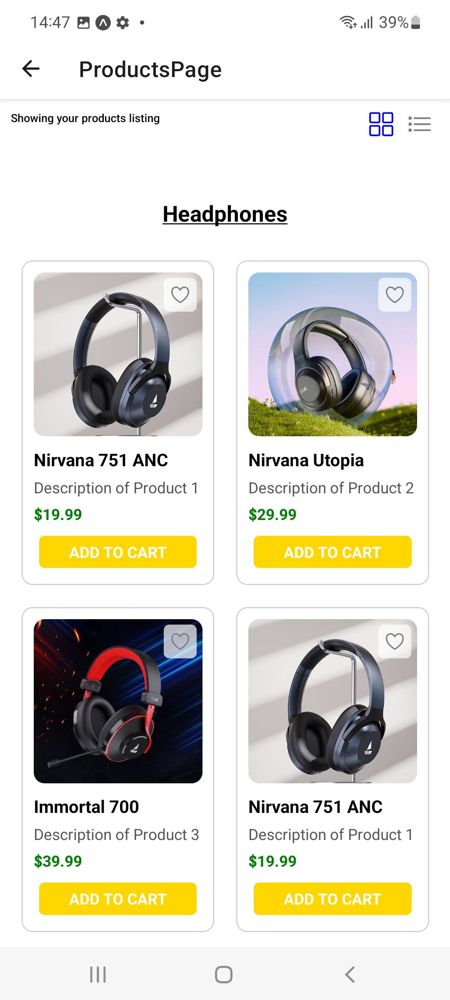
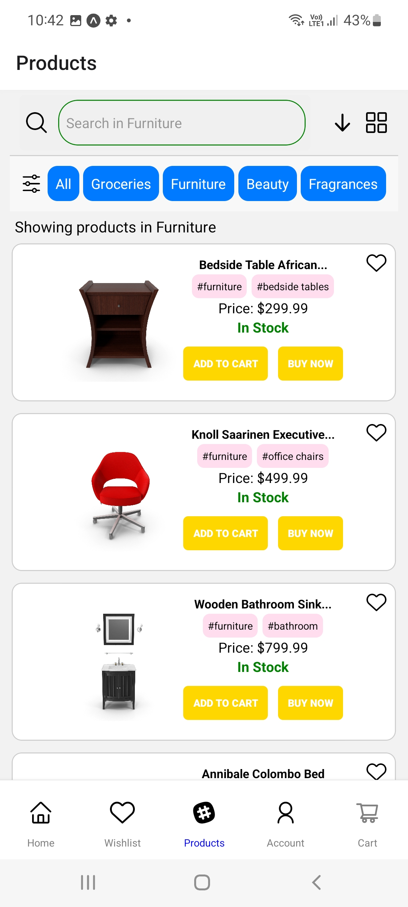
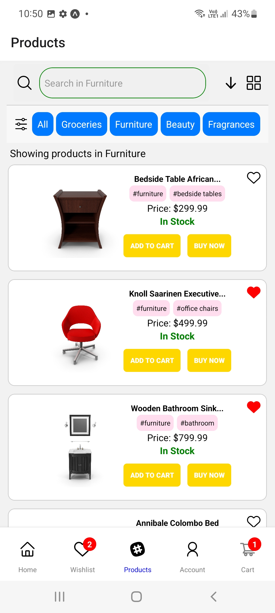
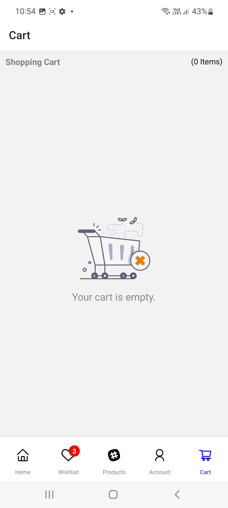

## Assignment Screenshots

#### Assignment-1

###### Welcome Page

#### Assignment-2

###### Registration Page

###### Login Page

###### Form Validation Added

  
  

  
  

###### Form Submission Success

  
  

#### Assignment-3

###### Reusable Button Components Display Page

#### Assignment-5

##### Products Page
###### Grid View Display

###### List View Display

#### Ecommerce App
###### Welcome Page, Login In and Registration Page

  
  
  
  

###### Product Page (Toggle View - Grid and List Type)

  
  

###### Product Details Page

  
  

###### Similar Products in Details Page fetched from the category whose product is currently being viewed

  

###### Wishlist Page with Personal Recommendation 

  

###### Using maximum count of wishlisted categories to recommend users personalised products. Handling Edge Case (Tie) : using latest product category in wishlist for recommmendation 
https://github.com/ADYASHA-2003/ReactNativeInternship/assets/106873284/d1d12eab-24eb-49d9-9382-fae5c9d82057

###### Adding a Product from Wishlist Page to Cart --> Cleared wishlist page, Visual Indication Badge 

  
  

###### Updating quantity of products in cart hence dynamically the total amount updated
https://github.com/ADYASHA-2003/ReactNativeInternship/assets/106873284/cc46a412-3920-4276-a75c-77a999764fff

###### Adding a Product to Cart and Checking Out

  
  
  

###### Payment Method Choice and Confirmation 

  
  
    

###### Orders Page and Emptied Cart when Order Placed Successfully

  
  

###### Editing Profile and Picking Profile Image

  
  
  

##### Screen Recordings from App 
https://github.com/ADYASHA-2003/ReactNativeInternship/assets/106873284/92a73d77-8aa2-46ae-b398-9363d4a1c7af

https://github.com/ADYASHA-2003/ReactNativeInternship/assets/106873284/d1e051c5-0f8e-40ac-b707-8343775b8cde

https://github.com/ADYASHA-2003/ReactNativeInternship/assets/106873284/d3704a6b-03d3-449c-a4df-950393ffc26c

https://github.com/ADYASHA-2003/ReactNativeInternship/assets/106873284/6d431ebd-4b2a-4852-9519-739a310edac6

